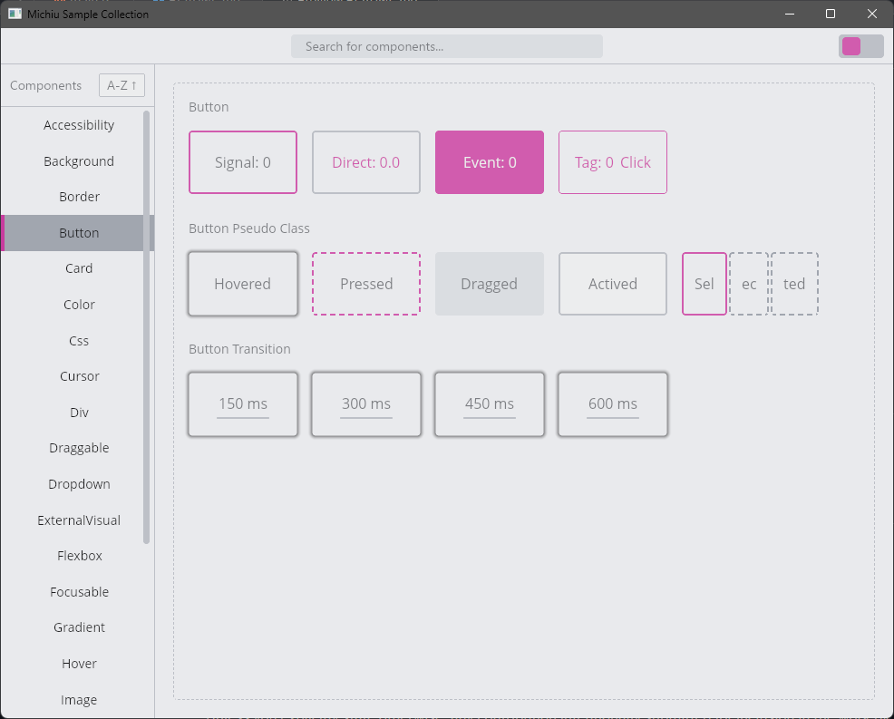
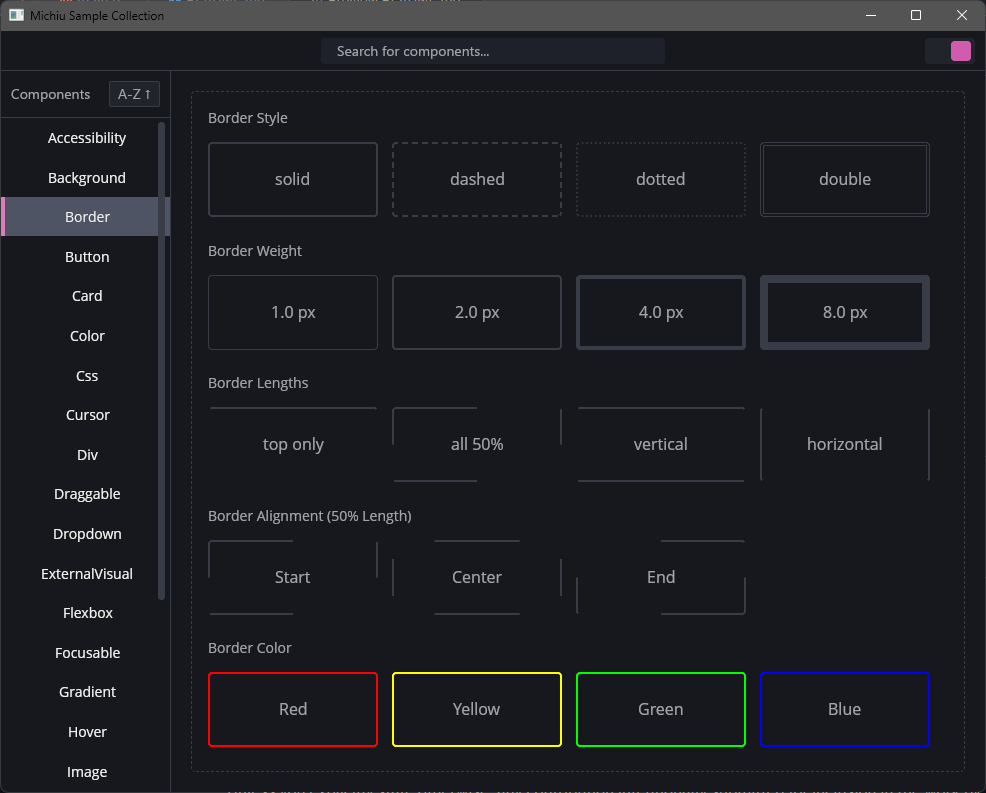
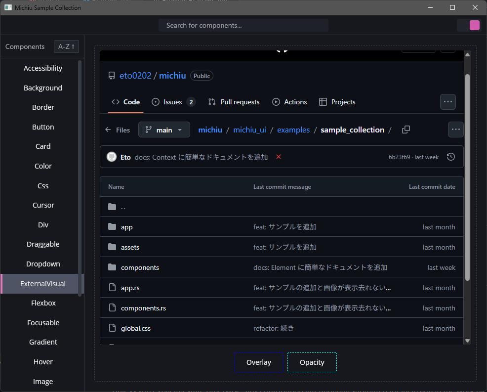
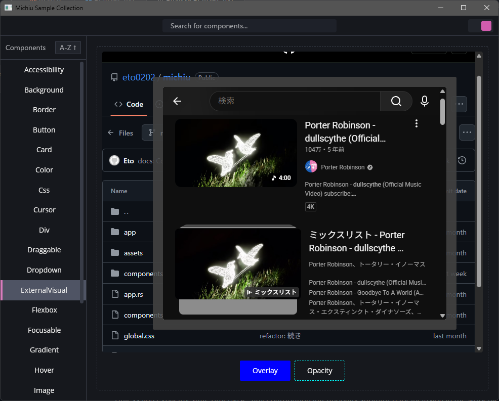
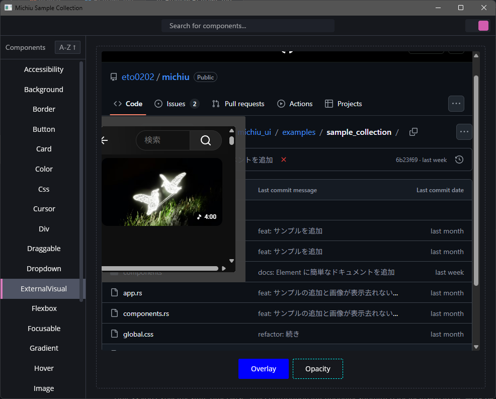
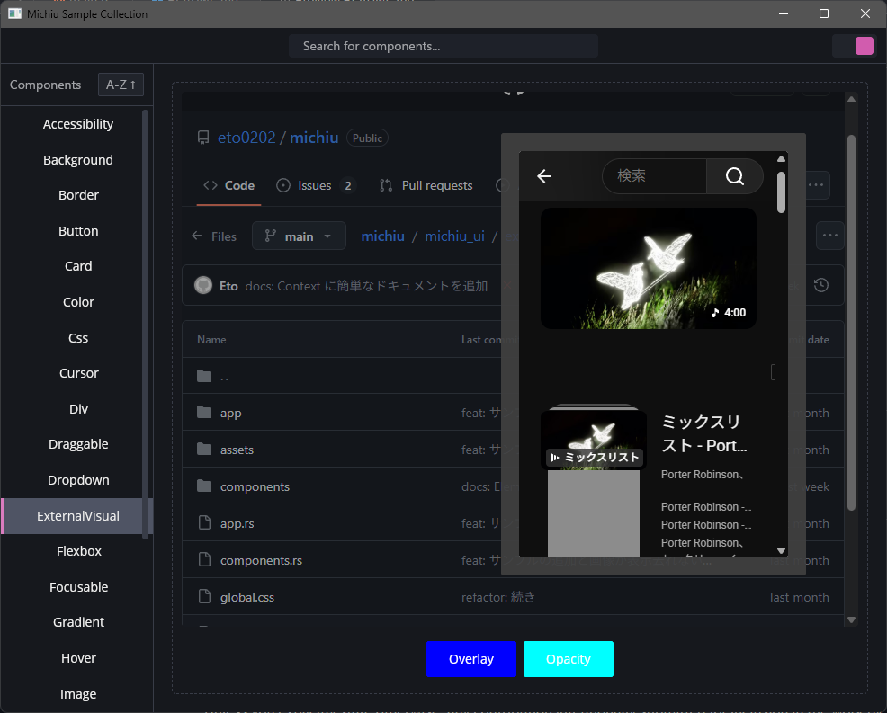

# michiu

The `michiu` is developing a GUI library for Windows.

Please note that since this is still under development, breaking changes may occur without prior notice.

- [michiu](https://github.com/eto0202/michiu/tree/main/michiu)
- [michiu_ui](https://github.com/eto0202/michiu/tree/main/michiu_ui)
- [michiu_window](https://github.com/eto0202/michiu/tree/main/michiu_window)
- [michiu_guard](https://github.com/eto0202/michiu/tree/main/michiu_guard)

### Pronunciation

`michiu` is pronounced roughly like "mee-chee-oo" (written in Japanese as 「みちぅ」).

## Examples

- [michiu_ui examples](https://github.com/eto0202/michiu/tree/main/michiu_ui/examples)
- [michiu_window examples](https://github.com/eto0202/michiu/tree/main/michiu_window/examples)

## Screenshot

#### Button Sample

#### Border Line Sample

#### Webview2 Sample

## License

Licensed under either of

- Apache License, Version 2.0 ([LICENSE-APACHE](LICENSE-APACHE) or http://www.apache.org/licenses/LICENSE-2.0)
- MIT license ([LICENSE-MIT](LICENSE-MIT) or http://opensource.org/licenses/MIT)

at your option.

### Contribution

Unless you explicitly state otherwise, any contribution intentionally submitted
for inclusion in the work by you, as defined in the Apache-2.0 license, shall be
dual licensed as above, without any additional terms or conditions.
